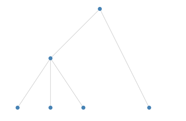
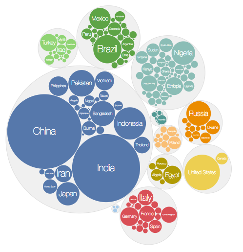
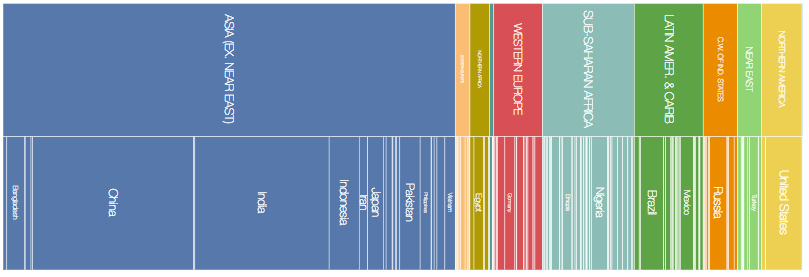

### Link:

1. [SVG路径PATH](https://blog.csdn.net/qq_30668579/article/details/51381076)
2. [d3 cluster](https://juejin.im/post/5b39dbdd51882574957a86d6)
3. [d3js layout 深入理解](https://www.cnblogs.com/kidsitcn/p/7193629.html)
4. [D3.js中Radial Cluster Dendrogram详解](https://blog.csdn.net/wan353694124/article/details/78758241)
5. [D3.js从入门到“放弃”指南](https://www.cnblogs.com/fastmover/p/7779660.html)
6. [灰信网](http://www.freesion.com/)
7. [d3可视化实战00：d3的使用心得和学习资料汇总](https://www.cnblogs.com/zhangdi/p/4028818.html)
8. [夜舞暗澜_3ea2](https://www.jianshu.com/u/64f0eb4f9ad2)

### D3.js

#### 布局

  1. tree layout
  
  2. cluster layout
  
  3. treemap layout
  
  4. pack layout
  
  5. partition layout
  
  6. chord layout
  

#### 代码组成

&emsp;参考链接：

  * [D3 API 中文手册](https://github.com/d3/d3/wiki/API--%E4%B8%AD%E6%96%87%E6%89%8B%E5%86%8C)
  * [D3 API Reference](https://github.com/d3/d3/blob/master/API.md)

1. d3.arc({}) 弧形生成器

   ``` javascript
    d3.arc()
      .innerRadius(0) // 内半径访问器
      .outerRadius(100) // 外半径访问器
      .startAngle(0) // 开始角度访问器
      .endAngle(Math.PI / 2) // 结束角度访问器
   ```

2. d3.pie() 饼状图生成器

   ``` javascript
    d3.pie(data)
   ```

3. d3.tree() 树状图生成器

   ``` javascript
    d3.tree.size() // 定义树的大小
    d3.tree().separation() // 定义邻居节点的距离
   ```

4. d3.hierarchy() 层级布局

   ``` javascript
    d3.hierarchy().sum() // 后序遍历
   ```

5. d3.treemap() 矩形树生成器

   ``` javascript
    var treemap = d3.treemap()
    treemap.padding // 父子之间的间距
    treemap.size // 布局的尺寸
   ```
***
## 续更
### Link:

1. [嘿，不要给 async 函数写那么多 try/catch 了](https://juejin.im/post/5d25b39bf265da1bb67a4176)
2. [一个合格的中级前端工程师必须要掌握的 28 个 JavaScript 技巧](https://juejin.im/post/5cef46226fb9a07eaf2b7516)

